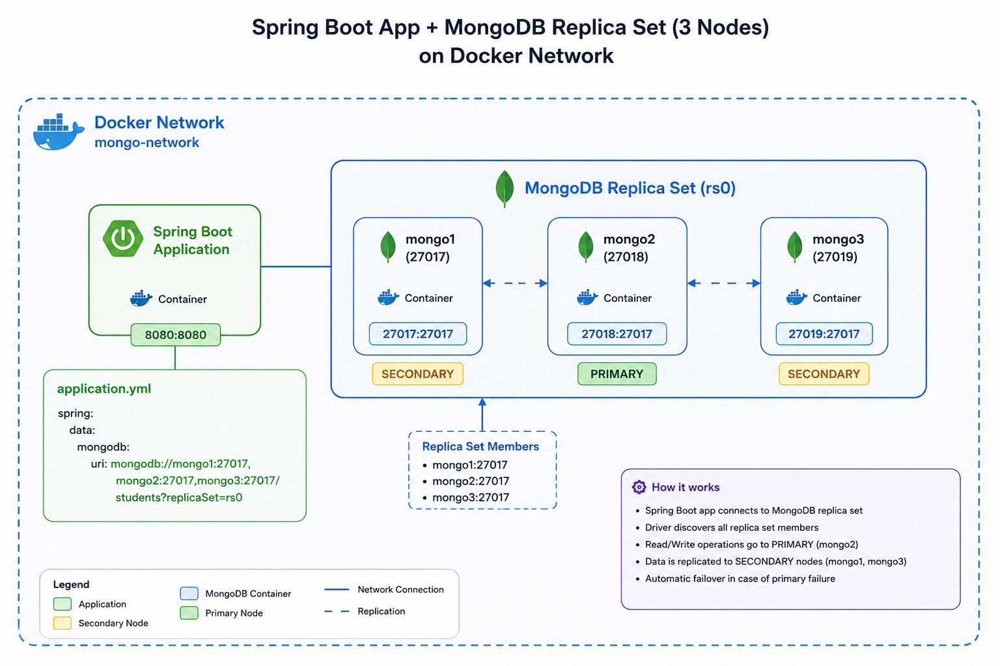

# Introduction
This is a simple app that you can use to test the behaviour of the mongo db replica sets

This app will set up below containers in your docker runtime
* mongo db cluster with replica set (one primary and 2 secondary)
* A sample app that does basic crud operation with the mongo cluster
# Architecture

# How to run the application

* Run `mvn clean install` from the project root to build the app. jar file. 
* Run `docker compose up -d` from the project root to create following containers in the docker environment.
    * App container
    * 3 mongo db nodes (mongo1, mongo2, mongo3)
* Log in to one of the mongo nodes(Ex: mongo1) and initialize the replica set with below command
  * `docker exec -it mongo1 mongosh`
  * `rs.initiate({_id: "rs0",
      members: [
      { _id: 0, host: "mongo1:27017" },
      { _id: 1, host: "mongo2:27017" },
      { _id: 2, host: "mongo3:27017" }
      ]
      })`
* Then you can use a tool ike postman to add and fetch data to mongo db vis exposed APIs.
* Use below command to check the status of the replica set
  * `rs.status()`
  * You can stop and restart the primary mongo node in replica set to see how replica set behave (primary re-election and automatic failover) in an node failure situation

